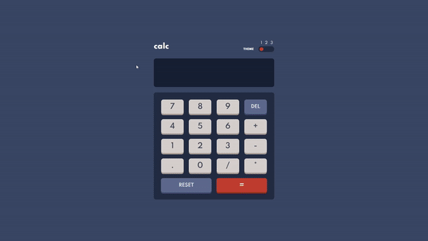

# Calculator app 📐

This is a solution to the [Calculator app challenge on Frontend Mentor](https://www.frontendmentor.io/challenges/calculator-app-9lteq5N29). Frontend Mentor challenges help you improve your coding skills by building realistic projects.

## Table of contents

- [Overview](#overview)
  - [About](#aboutapp)
  - [Change themes](#changethemes)
  - [Links](#links)
- [My process](#my-process)
  - [Built with](#built-with)
  - [What I learned](#what-i-learned)
  - [Continued development](#continued-development)
- [Author](#author)
- [Acknowledgments](#acknowledgments)


## Overview

### About

Calculator is a simple application where you can perform basic math operations such as addition, subtraction, division and multiplication.


### Change themes

The user has three different themes at his disposal



### Links

- URL: (https://donmikelee.github.io/calculator-app/)

## My process

### Built with

- SCSS 
- Flexbox
- vanillia JavaScript


### What I learned

The calculator project helped me expand my knowledge of the practical use of JavaScript. It is true that I can write an application using the react library, but so far I am working on a solid foundation as a very good knowledge of JS in practice.


```html
<h1>Below is the code I am proud of 😀</h1>
```

```js
const proudOfThisFunc = () => {
  let checkedValue = '';

const checkedInputHandler = () => {
  setInterval(() => {
    checkedValue = document.querySelector('input[name="toggle"]:checked').value;
  }, 100);
};

const changeThemeHandler = () => {
  for (let input of inputs) {
    input.addEventListener('change', function () {
      let inputValue = this.value;

      const elements = document.querySelectorAll(`.${checkedValue}`);

      elements.forEach((element) => {
        element.classList.replace(checkedValue, inputValue);
      });
    });
  }
};

window.onload = () => {
  checkedInputHandler();
  changeThemeHandler();
};

};
```

### Continued development

I will continue my learning with a frontend mentor. This is a great site that gives me ready projects to be carried out. I recommend it to any novice programmer who already has knowledge of front end programming, but needs more practice


## Author

- Michał 'donmikelee' Górny - (https://www.linkedin.com/in/micha%C5%82-g%C3%B3rny-5849b7193)


## Acknowledgments

Thank you Kondrad Linkowski for your help with the deployment of the project on github pages


